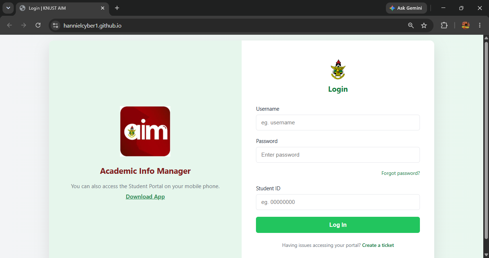

# 🎣 Phishing Awareness Demonstration Website

> **⚠️ Educational Project**  
> This project is a **phishing awareness demonstration** created for cybersecurity education and research purposes. It was developed to replicate a university login page as part of a controlled lab environment to demonstrate how phishing attacks work and how users can recognize them.

---

## 📖 Overview

This project recreates a university login page using HTML, CSS, and PHP to simulate a phishing website for educational purposes.

The objective is to understand:

- How phishing websites imitate legitimate services
- How credentials can be captured by attackers
- Why users should always verify URLs before entering sensitive information
- The importance of cybersecurity awareness and security training

**This project is intended strictly for educational use inside a lab environment.**

---

## ✨ Features

- 🎨 Responsive login page
- 🖥️ HTML & CSS frontend
- 🔐 PHP form processing
- 📁 Demonstrates credential capture workflow
- 📚 Suitable for cybersecurity awareness demonstrations

---

## 🛠️ Technologies Used

- HTML5
- CSS3
- PHP
- GitHub Pages (Frontend Preview)

---

## 📂 Project Structure

```text
.
├── assets/
├── credentials.txt
├── index.html
├── save.php
├── styles.css
└── README.md
```

---

## 🚀 Running the Project

### Option 1 — View the Frontend (GitHub Pages)

The static HTML and CSS can be viewed using GitHub Pages.

🔗 https://hannielcyber1.github.io/

> **Note:** The login form will not function because GitHub Pages only hosts static websites.

---

### Option 2 — Run Locally (Recommended)

Since this project uses **PHP**, it must be hosted on a web server that supports PHP, such as:

- XAMPP
- WAMP
- Laragon
- Apache + PHP
- Nginx + PHP
- Docker

Example:

```text
htdocs/
└── phishing-demo/
    ├── index.html
    ├── save.php
    ├── styles.css
    └── assets/
```

Then open:

```
http://localhost/phishing-demo/
```

---

## ⚠️ GitHub Pages Limitation

> **GitHub Pages does NOT execute PHP code.**

GitHub Pages only serves **static files** such as:

- HTML
- CSS
- JavaScript
- Images

Because of this:

- ❌ `save.php` will **not** run
- ❌ No credentials will be written to `credentials.txt`
- ❌ PHP functionality is disabled on GitHub Pages

If you wish to test the full project, run it locally using a PHP-enabled web server.

---

## 📸 Preview




---

## ⚠️ Disclaimer

This repository was created solely for:

- Cybersecurity education
- Phishing awareness training
- Ethical hacking practice
- Academic demonstrations

It is **not intended for malicious use**.

The author does **not** condone or encourage unauthorized phishing, credential theft, or illegal activities. Anyone using this project is responsible for complying with all applicable laws and ethical guidelines.

---

## 📄 License

This project is provided for educational purposes only.
